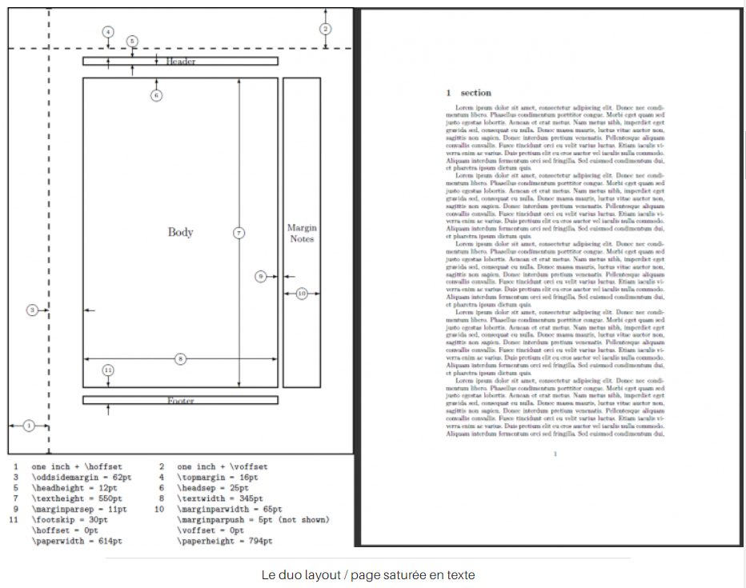
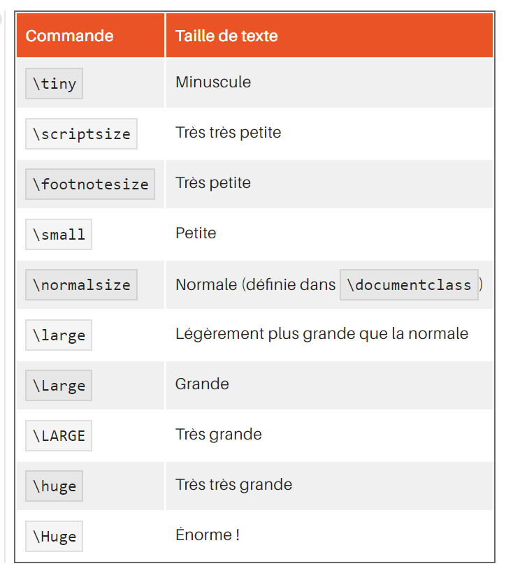

### LaTeX

#### Structures
##### page de garde

* le titre du document `\title{votre titre}` 
* l'auteur `\author{les noms des auteurs}` 
* la date `\date{la date que vous souhaitez}`

__Ces trois éléments sont introduits avant la commande `\begin{document}`, et une quatrième commande `\maketitle` se place juste après `\begin{document}` afin de faire comprendre à LaTeX que vous souhaitez composer une page de garde avec les trois éléments cités plus haut.__

##### marges 
* `usepackage{layout}` récupération du package layout}
* `\layout` instanciation d'un gabarit visible après compilation
* `usepackage{geometry}` permet de changer la taille des marges. 
ex : `\usepackage[top=2cm, bottom=2cm, left=2cm, right=2cm]{geometry}`



##### interlignage
* package `setspace`
* mot clé `onehalfspace`, `doublehalfspace`, pour limiter cela à une partie de 
la composition : `\begin{onehalfspace}...\end{onehalfspace}`
* interlignage personnalisé ???

##### listes 
* "ul"
```
\begin{itemize}
\item item1
\item item2
\item[@] item3 %utilise un @ comme puce
\item[0] item4 %utilise un 0 comme puce 
...
\end{itemize}
```

* "ol"
```
\begin{enumerate}
\item item1
\item item2
\item[@] item3 %utilise un @ comme puce
\item[0] item4 %utilise un 0 comme puce 
...
\end{enumerate}
```
* "dl"
```
\begin{description}
\item[Un canard :] bestiole qui fait coin.
\item[Un poulpe :] bestiole qui fait bloub.
\item[Un ornithorynque :] bestiole qui fait rire.
\item[Un ours :] bestiole qui fait mal.
\end{description}
```

##### en-tête et pied de page 
* le style `plain` : il permet d'insérer le numéro de page au milieu du pied de 
page ;
* le style `headings` : il permet d'insérer le nom du chapitre et le numéro de 
page en en-tête. Le pied de page est vide ;
* le style `empty` : l'en-tête et le pied de page sont vides.

* `\pagestyle{nom du style}`

##### en vrac
* `\apendix` transforme chaitre en annexe ( d'autres modifications de 
numerotation existent, voir `\frontmatter`, `\mainmatter`, `\backmatter` )

* `\chapter` ne fonctionne que dans les rapports et les livres

* `*` en fin de mot permet de créer des parties, paragraphes, sections, ... sans
numéro ex: `\chapter*{nom du chapitre}`

* `\documentclass[option1, option2, option3]{type}` permet de gérer des choses tels que format du papier, taille de police, ...


##### police
* `\commande{texte}`


* `\emph{text}` met en valeur le texte automatiquement selon le contexte du texte.
* `\textcolor{couleur}{texte en couleur}` dont les couelurs de base sont black, white, red, green, blue, yellow, magenta et cyan.
* `\definecolor` permet de définir une [couleur](http://latexcolor.com/) perso à utiliser avec textcolor
	* \definecolor{light-gray}{gray}{0.95}` ou gray est un nombre a deux décimales entre 0 et 1.
	* `\definecolor{orange}{rgb}{1,0.5,0}`
	* `\definecolor{orange}{RGB}{255,127,0}`
	* `\definecolor{orange}{HTML}{FF7F00}`
	* `\definecolor{orange}{cmyk}{0,0.5,1,0}`
* `\usepackage{nom_du_pack}` permet de définir une [police](https://www.gutenberg.eu.org/Le-catalogue-des-polices-pour) à utiliser pour le document
	* `{\fontfamily{code_de_la_police}\selectfont mon bout de texte}` modification ponctuelles de [polices](https://openclassrooms.com/courses/redigez-des-documents-de-qualite-avec-latex/les-polices-2#/id/r-1623755)

#### citations/code/url/
* `\begin(quote)` courte citation (moins de tab en début de ligne)
* `\begin(quotation)` longue citation (plus de tab en début de ligne)
* `\verb` permet de citer du code, délimité par un caractère choisi arbitrairement ex : `\verb| Mon bout de code {} |`  (attention au choix de ce caractère !! il ne peut pas se trouver dans le code !)
* `\usepackage{verbatim}` + `\begin{verbatim}` permet d'encadrer de gros volumes de codes
* `\usepackage{moreverb}` + `\begin{verbatimtab}[nbre_d'espaces_par_tab]` permet de choisir combien d 'espaces vaut une tab (contrairement a `verbatim` simple)
* `\usepackage(listings)` + 
```
\lstset{ %
language=nom_du_langage,        % choix du langage
basicstyle=\footnotesize,       % taille de la police du code
numbers=left,                   % placer le numéro de chaque ligne à gauche (left) 
numbers=right,                  % placer le numéro de chaque ligne à droite (right)
numberstyle=\normalsize,        % taille de la police des numéros
numbersep=7pt,                  % distance entre le code et sa numérotation
backgroundcolor=\color{white},  % couleur du fond 
% Possibilité d'utilisation du package color
}

``` + `\begin{lstlisting}`
Permet de mettre en couleur/style du code de facon plus poussé, (cfr [Langages compatibles)](https://en.wikibooks.org/wiki/LaTeX/Source_Code_Listings)
* `\url{adresse}` permet de faire des liens url cliquables
