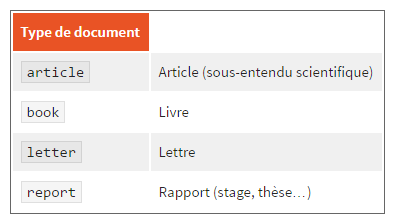
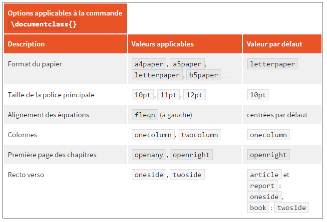

### LaTeX

#### Structures
##### page de garde

* le titre du document `\title{votre titre}` 
* l'auteur `\author{les noms des auteurs}` 
* la date `\date{la date que vous souhaitez}`

__Ces trois éléments sont introduits avant la commande `\begin{document}`, et une quatrième commande `\maketitle` se place juste après `\begin{document}` afin de faire comprendre à LaTeX que vous souhaitez composer une page de garde avec les trois éléments cités plus haut.__

##### marges 
* `usepackage{layout}` récupération du package layout}
* `\layout` instanciation d'un gabarit visible après compilation
* `usepackage{geometry}` permet de changer la taille des marges. 
ex : `\usepackage[top=2cm, bottom=2cm, left=2cm, right=2cm]{geometry}`

##### interlignage
* package `setspace`
* mot clé `onehalfspace`, `doublehalfspace`, pour limiter cela à une partie de 
la composition : `\begin{onehalfspace}...\end{onehalfspace}`
* interlignage personnalisé ???

##### listes 
* "ul"
```
\begin{itemize}
\item item1
\item item2
\item[@] item3 %utilise un @ comme puce
\item[0] item4 %utilise un 0 comme puce 
...
\end{itemize}
```

* "ol"
```
\begin{enumerate}
\item item1
\item item2
\item[@] item3 %utilise un @ comme puce
\item[0] item4 %utilise un 0 comme puce 
...
\end{enumerate}
```
* "dl"
```
\begin{description}
\item[Un canard :] bestiole qui fait coin.
\item[Un poulpe :] bestiole qui fait bloub.
\item[Un ornithorynque :] bestiole qui fait rire.
\item[Un ours :] bestiole qui fait mal.
\end{description}
```

##### en-tête et pied de page 
* le style plain : il permet d'insérer le numéro de page au milieu du pied de 
page ;
* le style headings : il permet d'insérer le nom du chapitre et le numéro de 
page en en-tête. Le pied de page est vide ;
* le style empty : l'en-tête et le pied de page sont vides.

* `\pagestyle{nom du style}`

##### en vrac
* `\apendix` transforme chaitre en annexe ( d'autres modifications de 
numerotation existent, voir `\frontmatter`, `\mainmatter`, `\backmatter` )

* `\chapter` ne fonctionne que dans les rapports et les livres

* `*` en fin de mot permet de créer des parties, paragraphes, sections, ... sans
numéro ex: `\chapter*{nom du chapitre}`

* `\documentclass[option1, option2, option3]{type}` permet de gérer des choses tels que format du papier, taille de police, ...


